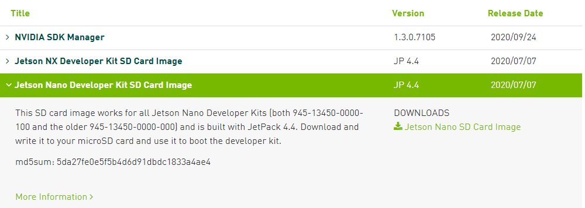

Version of [jetson nano image](https://developer.nvidia.com/embedded/downloads): JP 4.4, 2020/07/07



Version of [librealsense](https://github.com/IntelRealSense/librealsense/tree/v2.38.1): 2.38.1

Version of [librealsense-ros](https://github.com/IntelRealSense/realsense-ros/tree/2.2.17): 2.2.17


Install ROS

```bash
$ cd installROS
$ ./installROS.sh -p ros-melodic-desktop-full -p ros-melodic-rgbd-launch
```

Install librealsense

```bash
$ cd installLibrealsen
$ ./installLibrealsense.sh
$ ./buildLibrealsense.sh
```

Install librealsense-ros

```bash
$ cd installRealSenseROS
$ ./installRealSenseROS.sh <catkin_ws_name>
```

The script 'setupNano.sh' under folder  installRealSenseROS simply turns off the USB autosuspend setting on the Jetson Nano so that the camera is always available. 