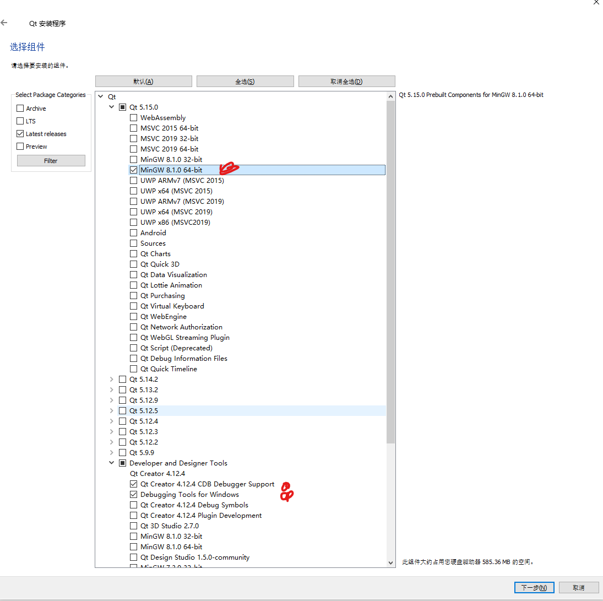
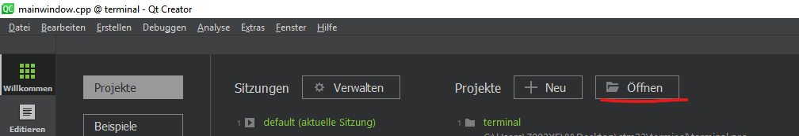
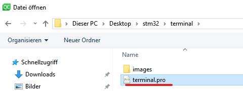
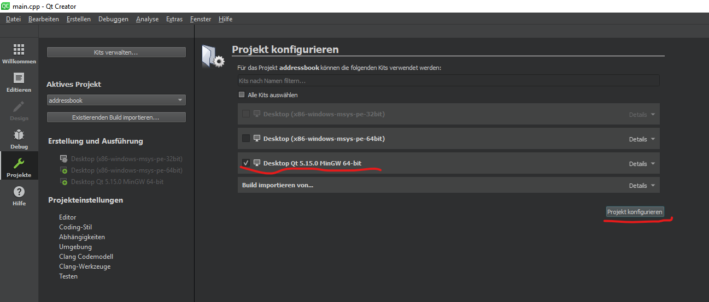
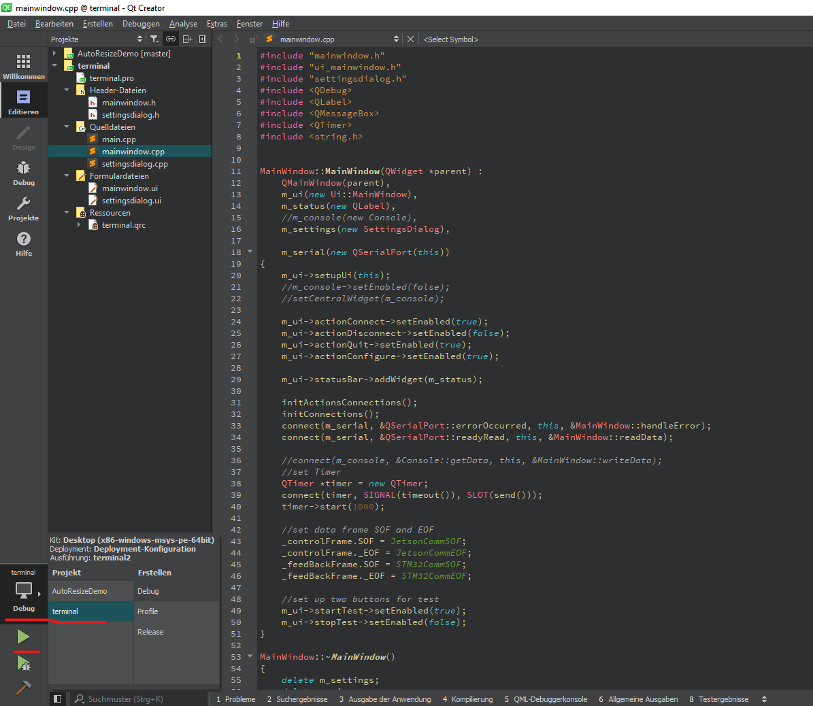
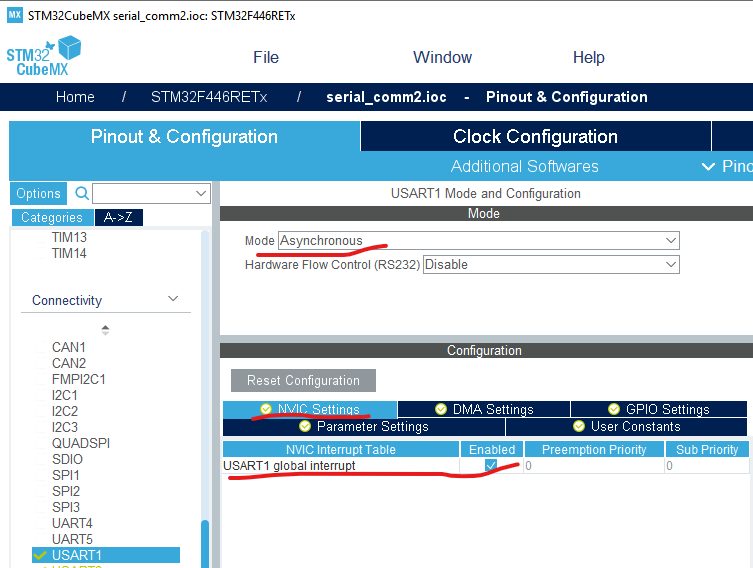
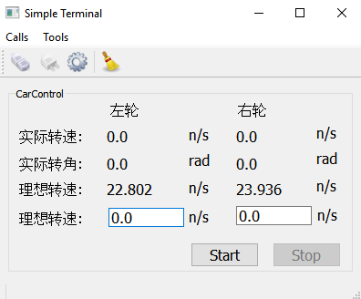
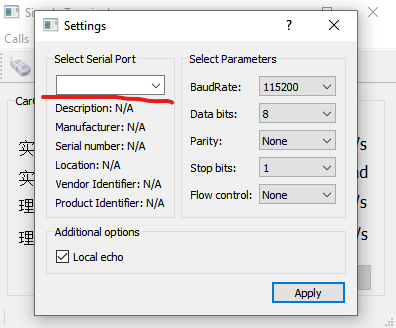
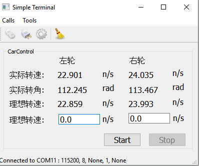
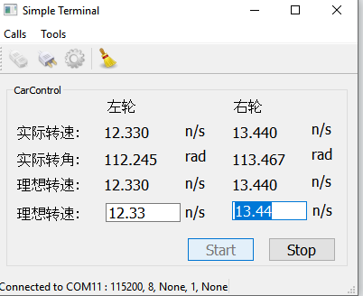

# 上下机通信-编程篇

## 纯通信编程-结合图形界面用于调试

1. [软件准备](#软件准备)
2. [在Qt-Creator中的编程](#在Qt-Creator中的编程)
3. [STM32CubeMX配置串口通信接口](#STM32CubeMX配置串口通信接口)
4. [Keil-MDK中给STM32板子编写与烧写程序](#Keil-MDK中给STM32板子编写与烧写程序)
5. [功能介绍](#功能介绍)

### 软件准备

- Win10 编程环境

- [Qt Creator](#Qt-Creator的安装#) for 上位机程序编程
- [Keil MDK](http://www2.keil.com/mdk5) for stm32 单片机的编程
- [STM32CubeMX](https://www.st.com/en/development-tools/stm32cubemx.html) for 自动生成stm32所需配置文件
- [ST-LINK/V2, ST-LINK/V2-1 USB driver](https://www.st.com/content/st_com/en/products/development-tools/software-development-tools/stm32-software-development-tools/stm32-utilities/stsw-link009.html) for 烧写程序进stm32板子
- [PL2303 windows driver](http://www.prolific.com.tw/US/ShowProduct.aspx?p_id=225&pcid=41) for windows system的串口转USB的驱动

#### Qt-Creator的安装

1. 进入链接[https://www.qt.io/download-qt-installer?hsCtaTracking=99d9dd4f-5681-48d2-b096-470725510d34%7C074ddad0-fdef-4e53-8aa8-5e8a876d6ab4](https://www.qt.io/download-qt-installer?hsCtaTracking=99d9dd4f-5681-48d2-b096-470725510d34|074ddad0-fdef-4e53-8aa8-5e8a876d6ab4)

   点击Download

   

2. 下载界面中只需要选择如图做标记的三个选项

   

### 在Qt-Creator中的编程

1. 打开qt工程文件，.pro的文件名后缀

   

   

2. 配置编译程序

   

3. 选择要编译的项目和执行

   

### STM32CubeMX配置串口通信接口

1. 参考wiki中大疆A板入门使用文档中关于STM32CubeMX（smart-car/WiKi/）配置的内容。

2. 额外需要配置通信串口，图中选择的串口是USART1，在实际操作时根据连线情况可能需要更改。

   

### Keil-MDK中给STM32板子编写与烧写程序

1. 参考wiki中大疆A板入门使用文档中关于使用Keil MDK（smart-car/WiKi/）的内容

2. 将smart-car/serial_communication/src/stm32路径下的C/C++文件以及头文件复制进由STM32CubeMX配置自动生成的项目录的src文件夹下

   

3. 根据情况修改huart1变量，例如实际接线是USART3，则修改main.c中所有huart1为huart3。进而编译烧写。

### 功能介绍

上下位机的通信目前实现了纯串口方式的通信，通过这个可视化工具可以便捷调试，没有点击Start时，理想转速是程序中模拟的数值，stm32板子接收理想转速，然后经过pid调节（目前还没有，被设为空），实际转速转角以模拟值进行反馈，之后应由传感器提供数值。判断stm32板子是否与PC连接好，可以点击菜单栏的齿轮图形，进而会弹出如下的图形界面，在这种情况下意味着没有连接，否则会自动显示可选择的端口号。

点击菜单栏第一个连接图形后，上位机便和stm32板子建立了通信，上位机传输给下位机理想转速，下位机通过模拟计算得到实际转速转角的值并回传给上位机。

点击Start后，可以通过手动输入转速值来进行调速，点击Stop结束调速。点击扫把图形转速一键归零。点击第二个断开图形断开连接。

